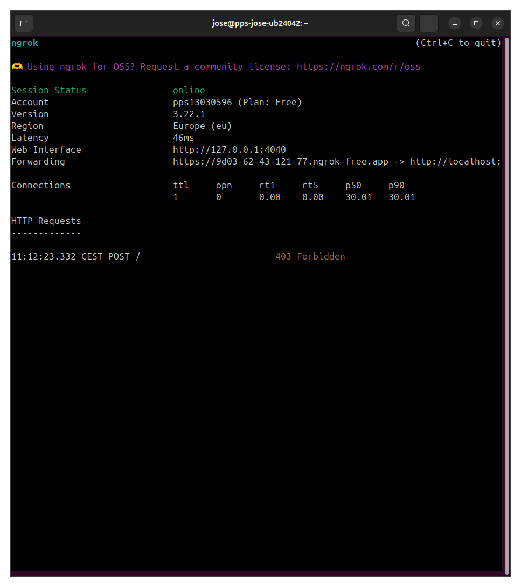

# Calculadora en Python

Este proyecto es una calculadora básica escrita en Python, diseñada para demostrar el uso de **Jenkins** para **Integración Continua (CI)**. Incluye operaciones matemáticas básicas y pruebas unitarias para validar su funcionamiento.

---

## Estructura del Proyecto

```
/calculadora/
├── Jenkinsfile           # Definición del pipeline de Jenkins
├── calculadora.py        # Interfaz interactiva para la calculadora
├── operaciones.py        # Funciones matemáticas básicas
├── test_calcv2.py        # Pruebas unitarias
└── README.md             # Documentación del proyecto
```

---

## Funcionalidades

- ✅ **Suma**  
- ✅ **Resta**  
- ✅ **Multiplicación**  
- ✅ **División (con manejo de división por cero)**  

---

## Uso

Ejecuta la calculadora desde la línea de comandos:

```bash
python3 calculadora.py
```

---

## 🧪 Pruebas Unitarias

Para ejecutar las pruebas unitarias:

```bash
python3 -m unittest discover -s . -p "test_*.py"
```

---

## 📦 Configurar el Pipeline en Jenkins

### **Paso 1: Crear el Proyecto en Jenkins**

1. Crea un nuevo proyecto de tipo **Pipeline**.  
2. Copia el contenido del archivo **Jenkinsfile** en la configuración del proyecto.  
3. Guarda los cambios.  

### **Paso 2: Configurar el Webhook en GitHub**

- **Payload URL:** `http://<TU_IP_O_DOMINIO>:8080/github-webhook/`  
- **Content type:** `application/json`  
- **Events:** `Just the push event.`  

---

## 🛠️ Pipeline (Jenkinsfile)

```groovy
pipeline {
    agent any

    stages {
        stage('Checkout') {
            steps {
                git url: 'https://github.com/pps13030596/calculadora', branch: 'main'
            }
        }

        stage('Set Up Environment') {
            steps {
                script {
                    sh 'python3 -m venv venv'
                    sh './venv/bin/pip install --upgrade pip'
                    sh './venv/bin/pip install unittest2'
                }
            }
        }

        stage('Unit Test') {
            steps {
                script {
                    sh './venv/bin/python -m unittest discover -s . -p "test_*.py"'
                }
            }
        }
    }

    post {
        always {
            echo 'Pipeline completado.'
            cleanWs()
        }
        success {
            echo '✅ Todas las pruebas pasaron correctamente.'
        }
        failure {
            echo '❌ Algunas pruebas fallaron. Revisa los detalles.'
        }
    }
}
```

---

## Pruebas de Fallos

- Introduce errores intencionales en **`operaciones.py`** para verificar que el pipeline detecte fallos correctamente.  
- Verifica los mensajes de error en Jenkins.  

---

## Notas Adicionales

- Si usas un repositorio privado, asegúrate de configurar las credenciales en Jenkins.  
- Si Jenkins está en Docker, asegúrate de que el puerto **8080** esté correctamente expuesto.  
- Usa **ngrok** o **Cloudflare Tunnel** para exponer tu Jenkins a Internet si es necesario.  

## Capturas del Ejercicio

%20[Corriendo]%20-%20Oracle%20VirtualBox.png)
%20[Corriendo]%20-%20Oracle%20VirtualBox.png)
%20[Corriendo]%20-%20Oracle%20VirtualBox.png)
%20[Corriendo]%20-%20Oracle%20VirtualBox.png)
%20[Corriendo]%20-%20Oracle%20VirtualBox.png)


