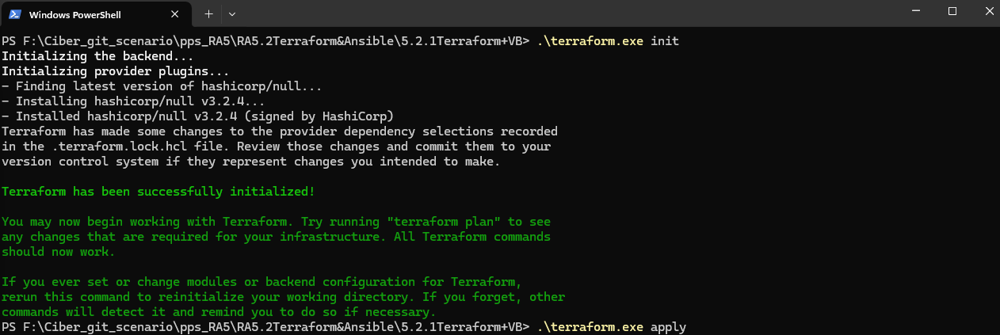

# RA5.2 – Provisionamiento de Máquina Virtual con Terraform y VirtualBox

## Requisitos

Antes de comenzar, asegúrate de tener las siguientes herramientas instaladas:

- [VirtualBox](https://www.virtualbox.org/)
- [Vagrant](https://developer.hashicorp.com/vagrant/downloads)
- [Terraform](https://developer.hashicorp.com/terraform/downloads)

### Instalación en Ubuntu

```bash
sudo apt update
sudo apt install virtualbox -y

# Descargar e instalar Vagrant
curl -O https://releases.hashicorp.com/vagrant/2.4.1/vagrant_2.4.1-1_amd64.deb
sudo dpkg -i vagrant_2.4.1-1_amd64.deb
sudo apt install -f -y

# Instalar Terraform desde Snap
sudo snap install terraform --classic
```

Verifica las versiones:

```bash
vagrant --version
terraform version
```

---

## Estructura del proyecto

```bash
terraform-vm/
└── main.tf
```

---

## Código del archivo `main.tf`

```
resource "null_resource" "vagrant_vm" {
  provisioner "local-exec" {
    command = "vagrant up"
  }

  triggers = {
    always_run = "${timestamp()}"
  }
}
```

## Código del archivo `Vagrantfile`

```
Vagrant.configure("2") do |config|
  config.vm.box = "hashicorp-education/ubuntu-24-04"
  config.vm.box_version = "0.1.0"

  config.vm.network "private_network", ip: "192.168.56.10"

  config.vm.provider "virtualbox" do |vb|
    vb.memory = 2048
    vb.cpus = 2
  end
end
```
---

## Ejecución de Terraform

### Inicializa el proyecto:

```bash
terraform init
```
Captura


### Aplica la configuración:

```bash
terraform apply
```

Cuando se te pida confirmación, escribe `yes`.

Captura


---

## Verificación

Puedes verificar que la máquina virtual está corriendo:

- Desde la interfaz de VirtualBox
- Con el comando:

```bash
vagrant global-status
```
Captura


---

## Destrucción de la VM (opcional)

```bash
terraform destroy
```

---

## Observaciones

- El box utilizado es `ubuntu/jammy64` (Ubuntu 22.04), ya que no hay uno oficial para 24.04 en Vagrant Cloud aún.
- La configuración con Ansible se realizará en los siguientes pasos.
