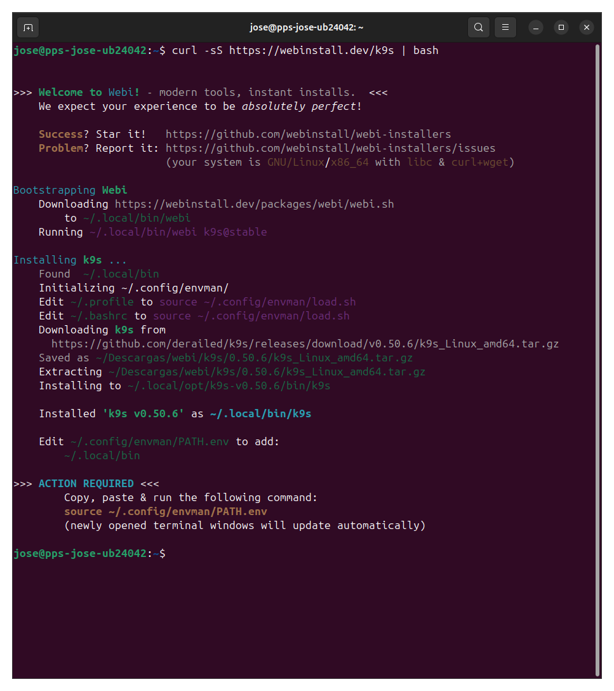

# Actividad 5.1 - Instalación y Configuración de K3s y K9s

## Paso 1: Instalación de K3s (Single-Node)

Instalación de un clúster K3s de un solo nodo:

```bash
curl -sfL https://get.k3s.io | sh -
```

Verificar que el nodo esté activo:

```bash
sudo k3s kubectl get nodes
```

---

## Paso 2: Despliegue de Nginx con 2 réplicas

Crear un archivo `nginx-deployment.yaml` con el siguiente contenido:

```yaml
apiVersion: apps/v1
kind: Deployment
metadata:
  name: nginx-deployment
spec:
  replicas: 2
  selector:
    matchLabels:
      app: nginx
  template:
    metadata:
      labels:
        app: nginx
    spec:
      containers:
      - name: nginx
        image: nginx:latest
        ports:
        - containerPort: 80
```

Aplicar el deployment:

```bash
sudo k3s kubectl apply -f nginx-deployment.yaml
```

Verificar que los pods estén corriendo:

```bash
sudo k3s kubectl get pods
```

---
## Capturas Paso 1 y 2


## Paso 3: Instalación y uso de K9s

Instalar K9s:

```bash
curl -sS https://webinstall.dev/k9s | bash
```

Si K9s no muestra los pods, especificar el `kubeconfig` de K3s:

```bash
~/.local/bin/k9s --kubeconfig /etc/rancher/k3s/k3s.yaml
```

O copiar el archivo al directorio por defecto:

```bash
mkdir -p ~/.kube
sudo cp /etc/rancher/k3s/k3s.yaml ~/.kube/config
sudo chown $USER:$USER ~/.kube/config
```

Luego simplemente ejecutar:

```bash
k9s
```

---

## Validación

Verificamos que el clúster está activo, que los pods de Nginx están ejecutándose y que K9s visualiza correctamente los recursos del clúster.

## Capturas del paso 3




