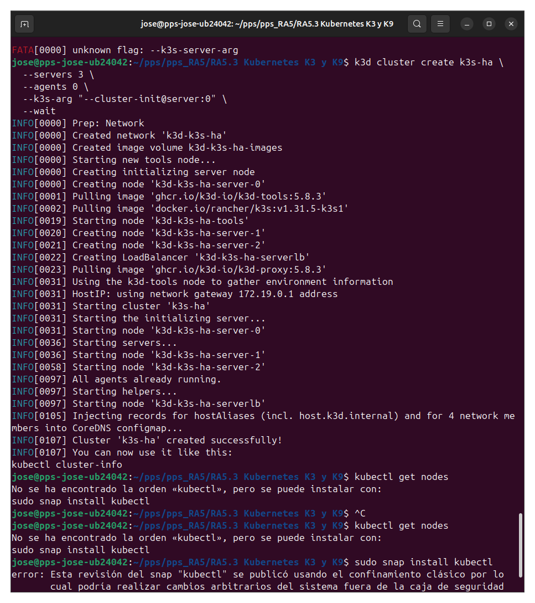
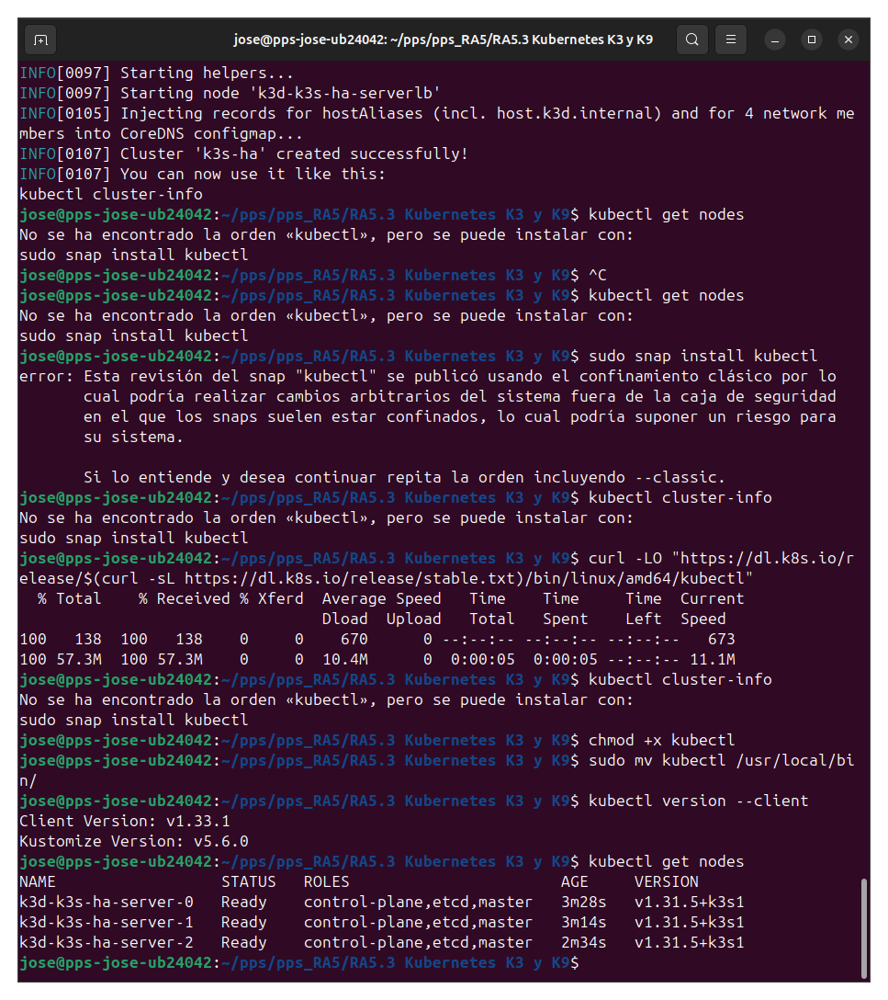
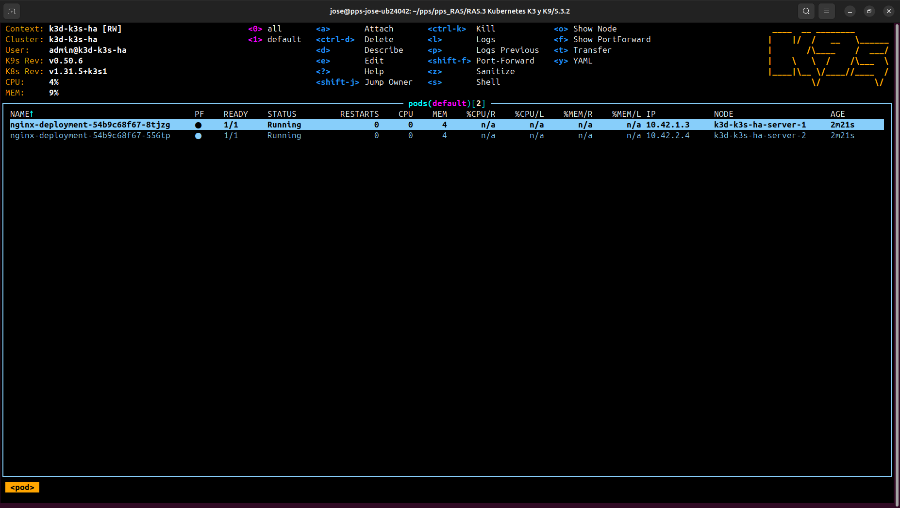
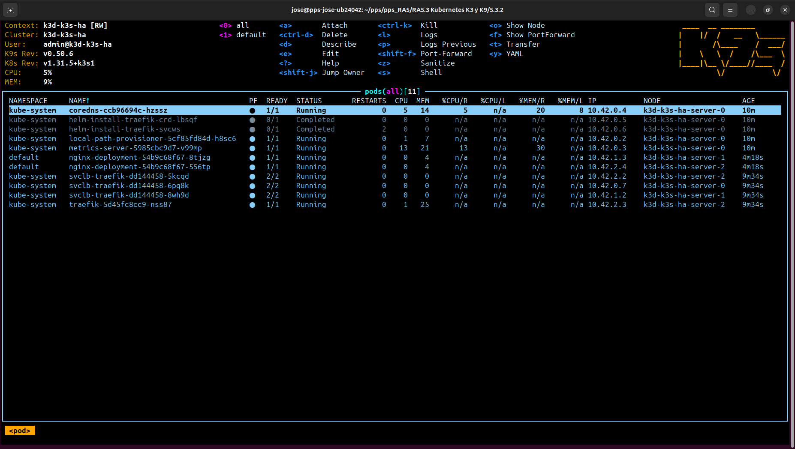

# Actividad 5.2 - K3s en modo Alta Disponibilidad (HA) con K9s

## Paso 1: Instalación de Docker y k3d

### Instalar Docker sino lo tenemos instalado:
```bash
# Add Docker's official GPG key:
sudo apt-get update
sudo apt-get install ca-certificates curl
sudo install -m 0755 -d /etc/apt/keyrings
sudo curl -fsSL https://download.docker.com/linux/ubuntu/gpg -o /etc/apt/keyrings/docker.asc
sudo chmod a+r /etc/apt/keyrings/docker.asc

# Add the repository to Apt sources:
echo \
  "deb [arch=$(dpkg --print-architecture) signed-by=/etc/apt/keyrings/docker.asc] https://download.docker.com/linux/ubuntu \
  $(. /etc/os-release && echo "${UBUNTU_CODENAME:-$VERSION_CODENAME}") stable" | \
  sudo tee /etc/apt/sources.list.d/docker.list > /dev/null
sudo apt-get update

sudo apt-get install docker-ce docker-ce-cli containerd.io docker-buildx-plugin docker-compose-plugin

sudo groupadd docker
sudo usermod -aG docker $USER
newgrp docker
```

### Instalar k3d sino lo tenemos instalado:
```bash
curl -s https://raw.githubusercontent.com/k3d-io/k3d/main/install.sh | bash
```

---

## Paso 2: Crear un clúster HA con 3 servidores

```bash
k3d cluster create k3s-ha \
  --servers 3 \
  --agents 0 \
  --k3s-arg "--cluster-init@server:0" \
  --wait
```

Este comando crea un clúster K3s con 3 nodos de control (alta disponibilidad).



---

## Paso 3: Instalar kubectl (si no estaba disponible)

```bash
curl -LO "https://dl.k8s.io/release/$(curl -sL https://dl.k8s.io/release/stable.txt)/bin/linux/amd64/kubectl"
chmod +x kubectl
sudo mv kubectl /usr/local/bin/
kubectl version --client
```

---
## Paso 4: Instalación de kubectl

###  Paso 1: Descargar el binario oficial

```bash
curl -LO "https://dl.k8s.io/release/$(curl -sL https://dl.k8s.io/release/stable.txt)/bin/linux/amd64/kubectl"
```

### Paso 2: Hacerlo ejecutable

```bash
chmod +x kubectl
```

### Paso 3: Moverlo a una ubicación del sistema

```bash
sudo mv kubectl /usr/local/bin/
```

### Paso 4: Verificar instalación

```bash
kubectl version --client
```

Esto instalará la última versión estable de kubectl y lo dejará listo para su uso.

---
## Paso 5: Desplegar Nginx con 2 réplicas

Crear archivo de despliegue:
nginx-deployment.yaml
```bash

apiVersion: apps/v1
kind: Deployment
metadata:
  name: nginx-deployment
spec:
  replicas: 2
  selector:
    matchLabels:
      app: nginx
  template:
    metadata:
      labels:
        app: nginx
    spec:
      containers:
      - name: nginx
        image: nginx:latest
        ports:
        - containerPort: 80
```

Aplicar el despliegue:

```bash
kubectl apply -f nginx-deployment.yaml
```

Verificar estado:

```bash
kubectl get pods
```

---

## Paso 6: Verificar con K9s

Lanzar K9s:

```bash
k9s
```

Puedes navegar entre los recursos y verificar que el deployment está en estado `Running`.

---

## Validación final

- Verificamos los 3 nodos en el clúster con `kubectl get nodes`
- Verificamos los 2 pods de nginx corriendo
- Usamos K9s para monitorear el estado

## Capturas







